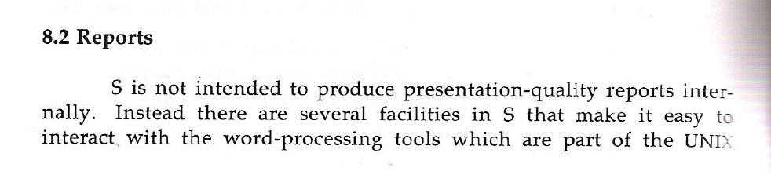
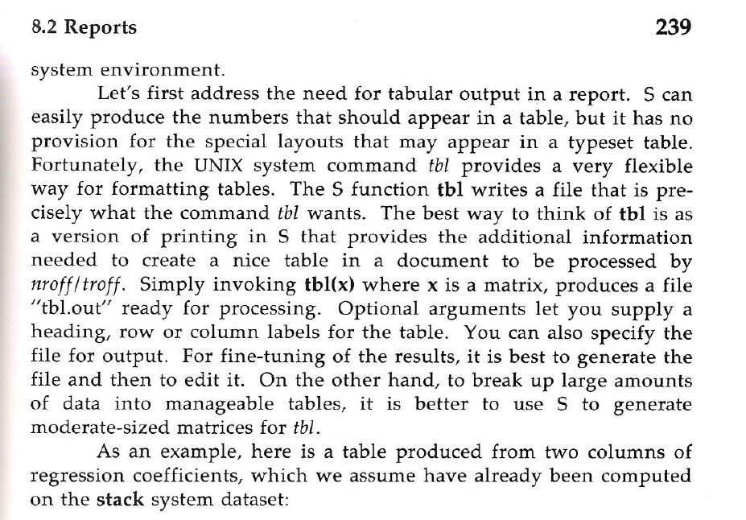
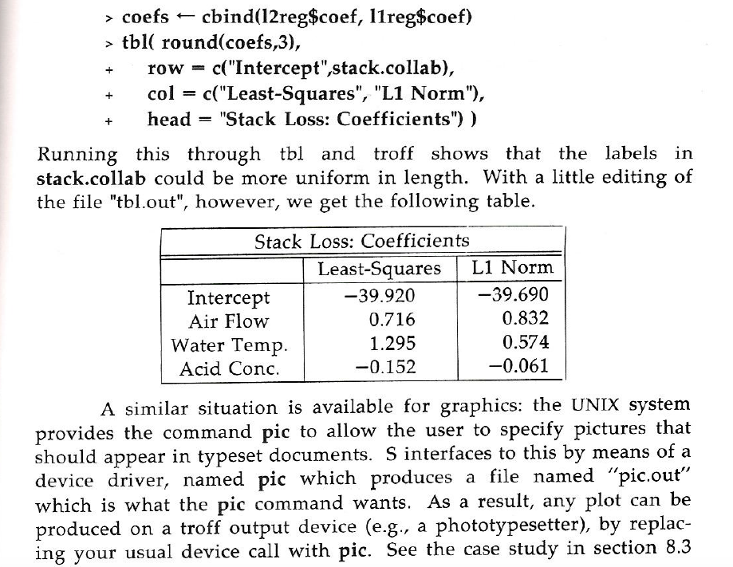
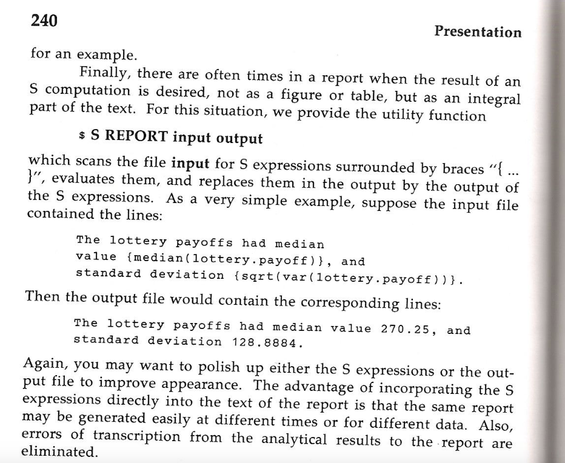

# but-is-it-literate

inspired by Y. Xie's [note on notebooks](https://yihui.name/en/2018/09/notebook-war/)

## historical reflection on the literature of literate statistical computing

A [2001 paper in CHANCE](https://amstat.tandfonline.com/doi/abs/10.1080/09332480.2001.10542284#.W6uA-hNKh0s) described the use of
[noweb](https://www.cs.tufts.edu/~nr/noweb/) for literate
statistical software development.

It was just literate programming applied to programming
for a simple simulation task.

This predated Sweave but not by much.  See [Leisch 2002](https://cran.r-project.org/doc/Rnews/Rnews_2002-3.pdf), and its reference to work by
Tony Rossini.

## purpose of this repo

The CHANCE paper is not readily available.  The noweb
associated with the paper goes beyond defining a function.
It demonstrates how a complete checkable package can be defined
in a single noweb file.  

With a proper installation of noweb, the following commands
(issued in a clone of this repo)
generate a very lightly modified HTML version of the paper:
```
notangle -t8 -R"AdminMakefile" Rpack.nw > AdminMakefile
make -f AdminMakefile Rpack.html
```
I have not figured out how to escape the angle brackets
needed for image inclusion.  A simple tweak to the generated
HTML includes the revised.png figure.

The following commands create and check the package.
```
notangle -t8 -R"AdminMakefile" Rpack.nw > AdminMakefile
make -f AdminMakefile package
```


## real use of noweb in statistical software development

Extensive use of noweb in advanced R software development
is found at Luke Tierney's [software projects site](http://homepage.divms.uiowa.edu/~luke/R/).
See for example the page on [regular expressions](http://homepage.divms.uiowa.edu/~luke/R/regexp.html).

## literate data analysis antecedents in S

John Chambers responded to a query I made in 2009 concerning
facilities I remembered seeing in S back in the 1990s.
Briefly, with S REPORT authors could combine nroff, pic, tbl and
S code to produce ... reports.  With figures, tables, and
textual citations of numbers that are programmatically generated.
Documentation from a 1984 volume on S was supplied by John.







